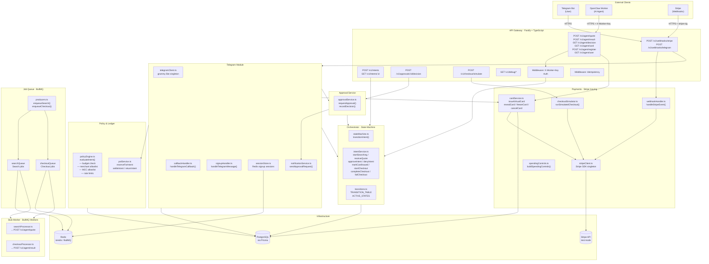
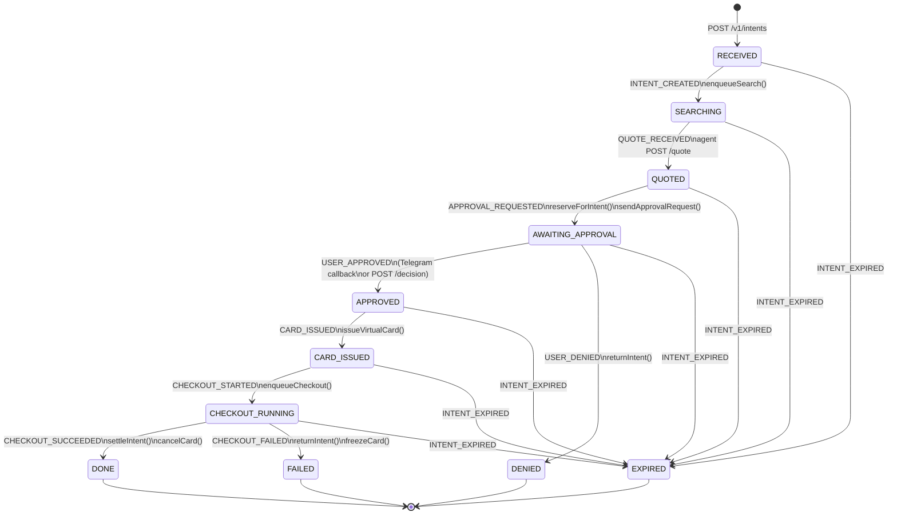
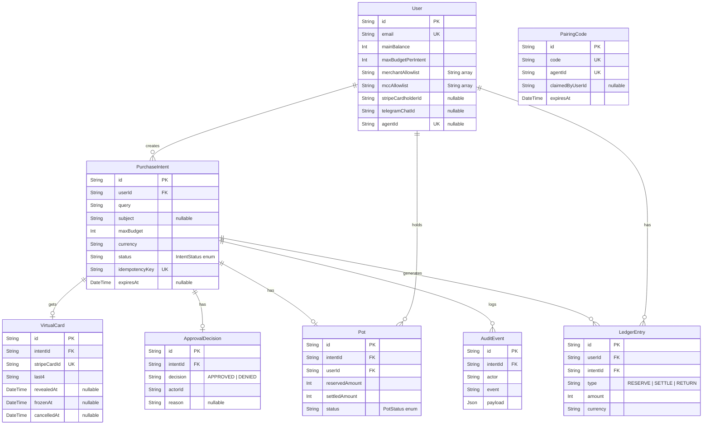
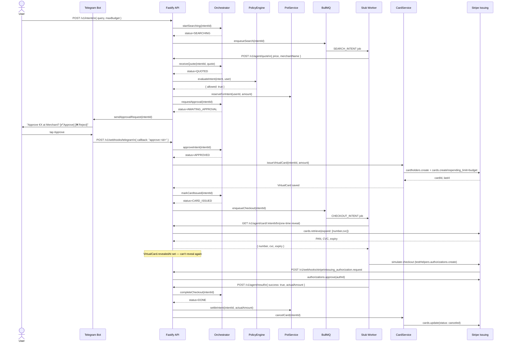

# Trusted Payment Infrastructure for Agents

> The secure payment rail every AI agent runs on. The agent can't spend a cent more than you said.

[](https://www.typescriptlang.org/)
[](https://fastify.dev/)
[](https://stripe.com/docs/issuing)
[](#running-tests)
[](LICENSE)










---

## The Problem

AI agents are going from novelty to necessity — in your pocket, in your business, in your supply chain. By end of 2026, 40% of enterprise applications will have embedded AI agents. Less than 5% have them today.

Every single one of those agent transactions needs a trust layer.

But right now there is no trusted, scoped, auditable payment primitive for agents.

Not with your real card — that's the same as handing your PIN to a stranger and saying *"be responsible."*
Not with a shared corporate card — that's how you get a $40,000 AWS bill from a rogue script.

Now picture this: your agent gets confused. Or compromised. Or just… ambitious. And instead of €40 of groceries, it orders €4,000 of something you definitely didn't ask for.

---

## The Solution

**Trusted Payment Infrastructure for Agents** is a payment rail that any AI agent plugs into. It enforces your intent at the financial primitive level — not at the application level.

> *"Please — only this much, only this merchant, only right now, make no mistake."*

When an agent needs to make a purchase:

1. The user approves a specific amount for a specific task
2. A one-time Stripe virtual card is issued, capped to exactly that amount — enforced at the card network level, not in software
3. The agent uses the card. It cannot spend a cent more than approved.
4. The moment the transaction completes, the card is gone

If the agent gets it wrong — spends more, tries a different merchant, tries again an hour later — the card is already dead. There is nothing left to misuse.

**One-time. Budgeted. Categorised. Time-boxed. Auditable.**

> *"We don't limit what agents can do — we limit what they can spend."*

This service is **payment infrastructure**, not an agent orchestrator. It does not tell agents what to buy. It gives any agent framework, shopping assistant, or autonomous procurement system a wallet with a conscience — and lets the spending controls do the rest.

Every single one of those agent transactions needs a trust layer. **We are that layer.**

---

## Goals & Outcomes

| Goal | How it's achieved |
|------|------------------|
| Zero credential exposure | Agent receives only an `intentId`; raw card data never leaves the server |
| Hard budget enforcement | Stripe Issuing spending controls cap the card at the approved amount per-authorization |
| Full auditability | Every state transition, approval, and Stripe event is logged to `AuditEvent` |
| User control | Approval step is mandatory; user can deny at any point via Telegram or API |
| Idempotent, retry-safe | Every mutating endpoint accepts `X-Idempotency-Key`; duplicate requests replay the stored response |
| Works on any Stripe account | Checkout simulation uses `testHelpers.issuing.authorizations` — no "Raw card data APIs" opt-in required |

---

## Architecture

```
┌─────────────────────────────────────────────────────────────────┐
│                        External Clients                          │
│                                                                  │
│   Telegram Bot ──────┐                                           │
│   OpenClaw Agent ────┤──▶  API Gateway (Fastify :3000)           │
│   Stripe Webhooks ───┘         │                                 │
└────────────────────────────────┼─────────────────────────────────┘
                                 │
              ┌──────────────────┼──────────────────────┐
              │                  │                       │
              ▼                  ▼                       ▼
     ┌─────────────┐    ┌────────────────┐    ┌──────────────────┐
     │ Orchestrator │    │ Payments        │    │ Policy & Ledger   │
     │ (state       │◀──▶│ (Stripe Issuing)│    │ (approval, pots,  │
     │  machine)    │    │                │    │  spending rules)  │
     └──────┬───────┘    └────────────────┘    └──────────────────┘
            │
            ▼
   ┌──────────────────┐        ┌──────────────────┐
   │  Job Queue        │        │  Telegram Module  │
   │  (BullMQ/Redis)  │        │  (signup, notifs, │
   │                  │        │   callback handler)│
   └────────┬─────────┘        └──────────────────┘
            │
            ▼
   ┌──────────────────┐
   │  Stub Worker     │
   │  (simulates      │
   │   OpenClaw)      │
   └──────────────────┘

            ──────────────────────────────────
                    PostgreSQL (Prisma)
            ──────────────────────────────────
```

### Intent State Machine

Every purchase is a `PurchaseIntent` tracked through an explicit state machine. No transition happens without an explicit event — every step is audited.

```
         ┌─────────────────────────────────────────────────────────────┐
         │                     PurchaseIntent                           │
         │                                                              │
  POST /v1/intents                                                      │
         │                                                              │
         ▼                                                              │
     RECEIVED ──INTENT_CREATED──▶ SEARCHING ──QUOTE_RECEIVED──▶ QUOTED │
                                                                    │   │
                                                      APPROVAL_REQUESTED│
                                                                    │   │
                                                                    ▼   │
                                               AWAITING_APPROVAL ──┤   │
                                                    │          │   │   │
                                             USER_DENIED   USER_APPROVED│
                                                    │          │       │
                                                    ▼          ▼       │
                                                 DENIED     APPROVED   │
                                                               │       │
                                                         CARD_ISSUED   │
                                                               │       │
                                                               ▼       │
                                                         CARD_ISSUED ──┤
                                                               │       │
                                                      CHECKOUT_STARTED │
                                                               │       │
                                                               ▼       │
                                                      CHECKOUT_RUNNING ─┤
                                                          │         │   │
                                               CHECKOUT_SUCCEEDED  CHECKOUT_FAILED
                                                          │         │   │
                                                          ▼         ▼   │
                                                        DONE      FAILED│
                                                                        │
                                   (any active state) ─INTENT_EXPIRED──▶ EXPIRED
         └─────────────────────────────────────────────────────────────┘
```

---

## Codebase Structure

```
.
├── src/
│   ├── contracts/          # Shared TypeScript types — single source of truth
│   │   ├── intent.ts       # IntentStatus enum, IntentEvent enum, PurchaseIntent type
│   │   ├── card.ts         # VirtualCard, CardReveal types
│   │   ├── ledger.ts       # LedgerEntry, Pot, LedgerEntryType enum
│   │   ├── approval.ts     # ApprovalDecision, PolicyResult types
│   │   ├── jobs.ts         # SearchIntentJob, CheckoutIntentJob payloads
│   │   ├── audit.ts        # AuditEvent type
│   │   ├── agent.ts        # Agent registration types (PairingCode)
│   │   ├── errors.ts       # Typed error classes (IntentNotFoundError, etc.)
│   │   ├── services.ts     # Service interface stubs (IOrchestrator, etc.)
│   │   └── index.ts        # Re-exports everything
│   │
│   ├── api/
│   │   ├── routes/
│   │   │   ├── intents.ts       # POST /v1/intents, GET /v1/intents/:id
│   │   │   ├── approvals.ts     # POST /v1/approvals/:id/decision
│   │   │   ├── agent.ts         # /v1/agent/* (register, quote, decision, result, card)
│   │   │   ├── checkout.ts      # POST /v1/checkout/simulate
│   │   │   ├── webhooks.ts      # POST /v1/webhooks/stripe + /telegram
│   │   │   ├── telegram.ts      # POST /v1/users/:userId/link-telegram
│   │   │   └── debug.ts         # GET /v1/debug/* (intents, ledger, audit, jobs)
│   │   ├── middleware/
│   │   │   ├── auth.ts          # X-Worker-Key verification
│   │   │   └── idempotency.ts   # X-Idempotency-Key replay
│   │   └── validators/          # Zod schemas for each route
│   │
│   ├── orchestrator/
│   │   ├── stateMachine.ts      # Legal transition table + IllegalTransitionError
│   │   ├── transitions.ts       # transitionIntent() — DB update + side effects
│   │   └── intentService.ts     # getIntentWithHistory(), createIntent()
│   │
│   ├── payments/
│   │   ├── stripeClient.ts      # Singleton Stripe SDK instance
│   │   ├── cardService.ts       # issueVirtualCard(), revealCard(), freezeCard(), cancelCard()
│   │   ├── checkoutSimulator.ts # runSimulatedCheckout() via Stripe testHelpers
│   │   ├── spendingControls.ts  # buildSpendingControls() helper
│   │   └── webhookHandler.ts    # handleStripeEvent() — signature verify + event routing
│   │
│   ├── policy/
│   │   └── policyEngine.ts      # evaluateIntent() — budget cap, allowlists, rate limits
│   │
│   ├── approval/
│   │   └── approvalService.ts   # requestApproval(), recordDecision()
│   │
│   ├── ledger/
│   │   ├── potService.ts        # reserveForIntent(), settleIntent(), returnIntent()
│   │   └── ledgerService.ts     # Low-level LedgerEntry writes
│   │
│   ├── telegram/
│   │   ├── telegramClient.ts    # Singleton Bot via getTelegramBot()
│   │   ├── notificationService.ts # sendApprovalRequest() — inline keyboard to user
│   │   ├── callbackHandler.ts   # handleTelegramCallback() — approve/reject button presses
│   │   ├── signupHandler.ts     # handleTelegramMessage() — /start <code> signup flow
│   │   └── sessionStore.ts      # Redis-backed conversation state (TTL 10 min)
│   │
│   ├── queue/
│   │   ├── queues.ts            # BullMQ Queue instances (search-queue, checkout-queue)
│   │   ├── producers.ts         # enqueueSearch(), enqueueCheckout()
│   │   └── jobTypes.ts          # Job payload types (from contracts)
│   │
│   ├── worker/
│   │   ├── stubWorker.ts        # Local stub that simulates an OpenClaw agent
│   │   └── processors/
│   │       ├── searchProcessor.ts   # Consumes search-queue, posts fake quote
│   │       └── checkoutProcessor.ts # Consumes checkout-queue, posts result
│   │
│   ├── config/
│   │   ├── env.ts               # Validated env vars (Zod)
│   │   └── redis.ts             # Redis singleton
│   │
│   ├── db/
│   │   ├── client.ts            # Prisma client singleton
│   │   └── seed.ts              # Demo user seeder
│   │
│   ├── app.ts                   # Fastify app factory (buildApp)
│   └── server.ts                # Entry point (starts HTTP server)
│
├── prisma/
│   ├── schema.prisma            # DB models
│   └── migrations/              # Prisma migration history
│
├── tests/
│   ├── unit/                    # Pure logic tests (no DB/network)
│   │   ├── api/                 # Route, middleware, validator tests
│   │   ├── orchestrator/        # State machine tests
│   │   ├── payments/            # Stripe service tests (mocked SDK)
│   │   ├── policy/              # Policy engine tests
│   │   ├── approval/            # Approval service tests
│   │   ├── ledger/              # Pot/ledger arithmetic tests
│   │   ├── queue/               # BullMQ producer tests
│   │   └── telegram/            # Signup + callback handler tests
│   └── integration/
│       └── e2e/                 # Full-lifecycle tests (real DB + Redis + Stripe test mode)
│
└── docs/
    ├── openclaw.md              # OpenClaw agent integration guide
    └── telegram-setup.md        # Telegram bot setup guide
```

---

## Quick Start

### Prerequisites

- **Node.js** 18+
- **Docker** (for Postgres + Redis)
- **Stripe account** in test mode — `sk_test_*` key from the Dashboard
- **Telegram bot token** (optional) — for approval notifications and user signup; see [docs/telegram-setup.md](docs/telegram-setup.md)

### 1. Install and configure

```bash
git clone https://github.com/your-org/trustedpaymentinfrastructureforagents
cd trustedpaymentinfrastructureforagents
npm install
cp .env.example .env
```

Open `.env` and fill in at minimum:

```env
STRIPE_SECRET_KEY=sk_test_...
WORKER_API_KEY=local-dev-worker-key
```

Everything else has safe defaults for local development.

### 2. Start infrastructure

```bash
docker compose up -d    # starts Postgres 16 + Redis 7
```

### 3. Migrate and seed

```bash
npm run db:migrate      # creates all tables
npm run seed            # creates demo user: demo@agentpay.dev, £1 000 balance
```

### 4. Start the server

```bash
npm run dev             # hot-reload dev server on http://localhost:3000
```

### 5. (Optional) Start the stub worker

The stub worker simulates an OpenClaw agent: it picks up search jobs, posts a fake quote, then picks up checkout jobs and posts a result. This lets you exercise the full flow locally without a real agent.

```bash
npm run worker
```

### 6. (Optional) Forward Stripe webhooks

Required to receive Issuing authorization events during local testing.

```bash
stripe listen --forward-to localhost:3000/v1/webhooks/stripe
# Copy the printed whsec_... value into .env as STRIPE_WEBHOOK_SECRET
```

### 7. (Optional) Expose for Telegram

Telegram webhooks require a public HTTPS URL. Use [ngrok](https://ngrok.com) locally:

```bash
ngrok http 3000
# → Forwarding https://abc123.ngrok-free.app → localhost:3000
```

Register with Telegram (one-time, re-run if the ngrok URL changes):

```bash
curl -X POST "https://api.telegram.org/bot<TOKEN>/setWebhook" \
  -H "Content-Type: application/json" \
  -d '{
    "url": "https://<your-ngrok-url>/v1/webhooks/telegram",
    "secret_token": "<TELEGRAM_WEBHOOK_SECRET>",
    "allowed_updates": ["message", "callback_query"],
    "drop_pending_updates": true
  }'
```

---

## End-to-End Flow

This is the full happy path. Replace `USER_ID` / `INTENT_ID` with real values.

### Step 1 — Create a purchase intent

```bash
curl -X POST http://localhost:3000/v1/intents \
  -H "Content-Type: application/json" \
  -H "X-Idempotency-Key: $(uuidgen)" \
  -d '{
    "userId": "USER_ID",
    "query": "Sony WH-1000XM5 headphones",
    "maxBudget": 30000,
    "currency": "eur"
  }'
# ← { "intentId": "clxxx...", "status": "SEARCHING" }
```

The intent is immediately enqueued on `search-queue` for the agent to pick up.

### Step 2 — Agent posts a quote

```bash
curl -X POST http://localhost:3000/v1/agent/quote \
  -H "Content-Type: application/json" \
  -H "X-Worker-Key: local-dev-worker-key" \
  -d '{
    "intentId": "INTENT_ID",
    "merchantName": "Amazon DE",
    "merchantUrl": "https://amazon.de/dp/B09XS7JWHH",
    "price": 27999,
    "currency": "eur"
  }'
# ← { "status": "AWAITING_APPROVAL" }
# Telegram notification sent to user if telegramChatId is set
```

### Step 3 — User approves

```bash
curl -X POST http://localhost:3000/v1/approvals/INTENT_ID/decision \
  -H "Content-Type: application/json" \
  -H "X-Idempotency-Key: $(uuidgen)" \
  -d '{ "decision": "APPROVED", "actorId": "USER_ID" }'
# ← { "status": "CARD_ISSUED" }
# Budget reserved in ledger; virtual card issued in Stripe
```

### Step 4 — Agent polls for decision and checkout params

```bash
curl http://localhost:3000/v1/agent/decision/INTENT_ID \
  -H "X-Worker-Key: local-dev-worker-key"
# ← {
#     "intentId": "INTENT_ID",
#     "status": "APPROVED",
#     "checkout": { "intentId": "INTENT_ID", "amount": 27999, "currency": "eur" }
#   }
```

### Step 5 — Agent simulates checkout

```bash
curl -X POST http://localhost:3000/v1/checkout/simulate \
  -H "Content-Type: application/json" \
  -d '{
    "intentId": "INTENT_ID",
    "amount": 27999,
    "currency": "eur",
    "merchantName": "Amazon DE"
  }'
# ← { "success": true, "chargeId": "iauth_...", "amount": 27999, "currency": "eur" }
# Stripe Issuing authorization created + captured; visible in Dashboard
```

### Step 6 — Agent reports the result

```bash
curl -X POST http://localhost:3000/v1/agent/result \
  -H "Content-Type: application/json" \
  -H "X-Worker-Key: local-dev-worker-key" \
  -d '{
    "intentId": "INTENT_ID",
    "success": true,
    "actualAmount": 27999,
    "receiptUrl": "https://amazon.de/order/123"
  }'
# ← { "status": "DONE" }
# Intent → DONE; ledger settled; pot closed; surplus returned to main balance
```

### Inspect the audit trail

```bash
curl http://localhost:3000/v1/debug/audit/INTENT_ID
curl http://localhost:3000/v1/debug/ledger/USER_ID
```

---

## OpenClaw Agent Integration

For the full agent integration guide — including registration, pairing, the decision polling loop, and the complete API contract — see [docs/openclaw.md](docs/openclaw.md).

The key design principle: **OpenClaw never handles raw card credentials**. The decision endpoint returns exactly what the simulate endpoint needs:

```
GET  /v1/agent/decision/:intentId  →  { checkout: { intentId, amount, currency } }
POST /v1/checkout/simulate         ←  { intentId, amount, currency, merchantName }
```

The server resolves the Stripe card internally via the `intentId → VirtualCard → stripeCardId` lookup.

---

## Telegram Integration

For the full bot setup and signup flow guide see [docs/telegram-setup.md](docs/telegram-setup.md).

**What Telegram adds:**
- Users receive an inline-keyboard approval notification the moment a quote comes in
- Users tap **Approve** or **Reject** — no app, no browser needed
- New users sign up by starting the bot with a pairing code from OpenClaw: `/start <code>`

---

## API Reference

### User / Intent endpoints

| Method | Path | Auth | Description |
|--------|------|------|-------------|
| `POST` | `/v1/intents` | — | Create purchase intent (`X-Idempotency-Key` required) |
| `GET` | `/v1/intents/:id` | — | Get intent + full audit history |
| `POST` | `/v1/approvals/:id/decision` | — | Approve or deny intent (`X-Idempotency-Key` required) |

### Agent / worker endpoints

| Method | Path | Auth | Description |
|--------|------|------|-------------|
| `POST` | `/v1/agent/register` | `X-Worker-Key` | Register an OpenClaw instance; get a pairing code |
| `GET` | `/v1/agent/user` | `X-Worker-Key` + `X-Agent-Id` | Resolve `userId` after user completes signup |
| `POST` | `/v1/agent/quote` | `X-Worker-Key` | Post search quote for a `SEARCHING` intent |
| `GET` | `/v1/agent/decision/:intentId` | `X-Worker-Key` | Poll approval status; returns `checkout` params when approved |
| `POST` | `/v1/agent/result` | `X-Worker-Key` | Report checkout outcome; finalises the intent |
| `GET` | `/v1/agent/card/:intentId` | `X-Worker-Key` | One-time raw card reveal (alternative to the decision flow) |

### Checkout simulation

| Method | Path | Auth | Body | Description |
|--------|------|------|------|-------------|
| `POST` | `/v1/checkout/simulate` | — | `{ intentId, amount, currency?, merchantName? }` | Simulate a merchant charge via Stripe Issuing test helpers |

**Response codes:**

| Code | Meaning |
|------|---------|
| `200` | Charge approved and captured — `{ success: true, chargeId, amount, currency }` |
| `402` | Card declined — `{ success: false, declineCode, message }` |
| `400` | Validation error |
| `500` | Unexpected error |

### Webhooks

| Method | Path | Description |
|--------|------|-------------|
| `POST` | `/v1/webhooks/stripe` | Stripe event receiver — signature verified with `STRIPE_WEBHOOK_SECRET` |
| `POST` | `/v1/webhooks/telegram` | Telegram update receiver — secret token verified |

### Telegram user management

| Method | Path | Auth | Description |
|--------|------|------|-------------|
| `POST` | `/v1/users/:userId/link-telegram` | — | Link a Telegram `chatId` to an existing user account |

### Debug / observability

| Method | Path | Description |
|--------|------|-------------|
| `GET` | `/v1/debug/intents` | List all intents with status + timestamps |
| `GET` | `/v1/debug/jobs` | BullMQ queue depths and recent job statuses |
| `GET` | `/v1/debug/ledger/:userId` | Full ledger + pot history for a user |
| `GET` | `/v1/debug/audit/:intentId` | Full audit trail for an intent |
| `GET` | `/health` | Health check |

---

## Environment Variables

Copy `.env.example` to `.env` and fill in:

| Variable | Required | Default | Description |
|----------|----------|---------|-------------|
| `DATABASE_URL` | Yes | — | PostgreSQL connection string |
| `REDIS_URL` | Yes | `redis://localhost:6379` | Redis connection string |
| `STRIPE_SECRET_KEY` | Yes | — | Stripe test-mode key (`sk_test_...`) |
| `STRIPE_WEBHOOK_SECRET` | Yes | — | Stripe webhook signing secret (`whsec_...`) |
| `WORKER_API_KEY` | Yes | `local-dev-worker-key` | Shared secret for agent endpoints |
| `TELEGRAM_BOT_TOKEN` | No | — | Telegram bot token from @BotFather |
| `TELEGRAM_WEBHOOK_SECRET` | No | — | Secret token for Telegram webhook verification |
| `TELEGRAM_TEST_CHAT_ID` | No | — | Chat ID for local integration smoke tests |
| `PORT` | No | `3000` | HTTP listen port |
| `NODE_ENV` | No | `development` | `development` / `test` / `production` |

---

## Running Tests

```bash
# All unit tests (fast, no external deps)
npm test

# Specific module
npm test -- --testPathPattern=orchestrator
npm test -- --testPathPattern=payments
npm test -- --testPathPattern=api
npm test -- --testPathPattern="policy|approval|ledger"
npm test -- --testPathPattern=queue
npm test -- --testPathPattern=telegram

# Integration tests (requires running Postgres + Redis + sk_test_* key)
npm run test:integration

# Single integration suite
npm run test:integration -- --testPathPattern=checkoutSimulator
npm run test:integration -- --testPathPattern=onboarding
```

Integration tests are skipped automatically when `STRIPE_SECRET_KEY` is not a `sk_test_*` key, so they are safe to run in CI with the appropriate secret.

---

## Security Model

| Concern | Mitigation |
|---------|-----------|
| Raw card PAN/CVC exposure | Never stored in DB or logs. `VirtualCard` holds only `stripeCardId` + `last4`. Agent receives only `intentId`. |
| Overspending | Stripe Issuing `spending_limits: [{ amount, interval: 'per_authorization' }]` enforced at the card network level. |
| One-time card use | Card is cancelled immediately after checkout succeeds or fails. |
| Double-spending | `revealedAt` prevents a second card reveal; `settleIntent` / `returnIntent` are idempotent. |
| Worker key leakage | `X-Worker-Key` is a server-side secret never sent to the end user. Restricted Stripe keys (`rk_*`) are recommended for production. |
| Webhook spoofing | Stripe webhooks verified via `stripe.webhooks.constructEvent()`. Telegram webhooks verified via secret token header. |
| Double-processing | `X-Idempotency-Key` middleware stores and replays responses. Approval decisions use `intentId` as their idempotency key. |

---

## Troubleshooting

**`"Missing required env var: DATABASE_URL"`**
→ Copy `.env.example` to `.env` and fill in the values.

**`"Can't reach database server at localhost:5432"`**
→ Run `docker compose up -d` and wait a few seconds for Postgres to initialise.

**`"Stripe webhook signature verification failed"`**
→ Ensure `stripe listen --forward-to ...` is running and `STRIPE_WEBHOOK_SECRET` in `.env` matches the `whsec_...` printed by the CLI.

**`"Cannot find module '@prisma/client'"`**
→ Run `npx prisma generate` to generate the Prisma client from the current schema.

**`"BullMQ jobs not processing"`**
→ Start `npm run worker` and verify Redis is running: `docker compose ps`.

**Integration tests failing with DB conflicts**
→ Run with `--runInBand`: `npm run test:integration -- --runInBand`.

**Telegram bot not receiving updates**
→ Check the ngrok URL is still the same (ngrok free tier changes on restart), then re-run the `setWebhook` curl command. See [docs/telegram-setup.md](docs/telegram-setup.md).

---

## Development Guide

### Adding a new route

1. Add the Zod schema to `src/api/validators/`
2. Add the route handler to the relevant file in `src/api/routes/`
3. Register the route in `src/app.ts`
4. Add unit tests in `tests/unit/api/`

### Adding a new intent event / transition

1. Add the event to `IntentEvent` in `src/contracts/intent.ts`
2. Add the transition to the legal transition table in `src/orchestrator/stateMachine.ts`
3. Add side effects in `src/orchestrator/transitions.ts`
4. Update unit tests in `tests/unit/orchestrator/`

### Module boundary rule

**Never import from another module's internal files.** Cross-module calls go through the public interface exported from that module's `index.ts`, or via direct function imports declared in `src/contracts/services.ts`.

---

## License

MIT
